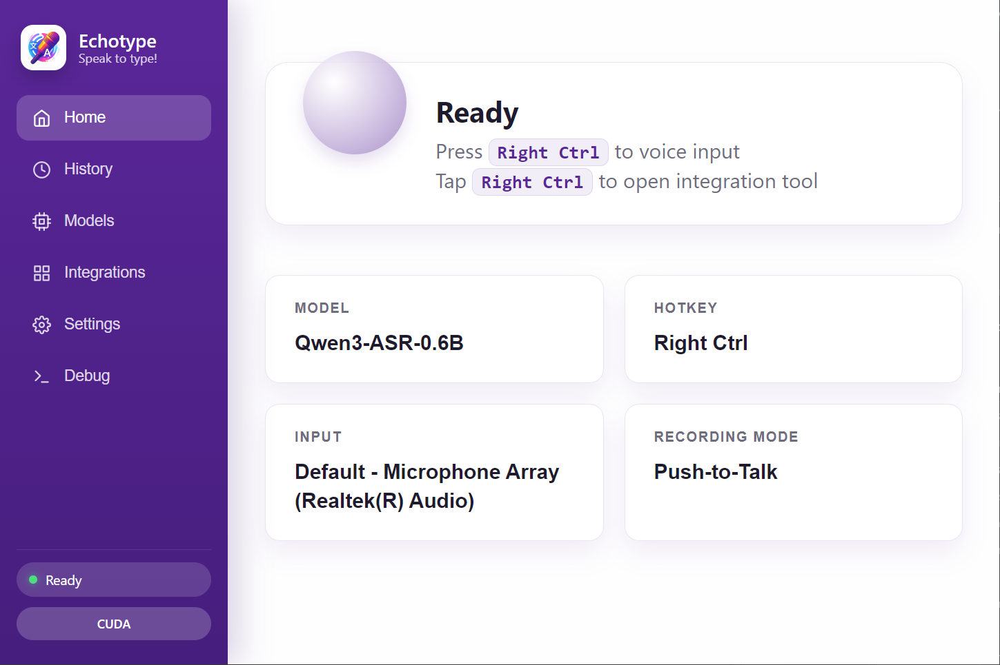
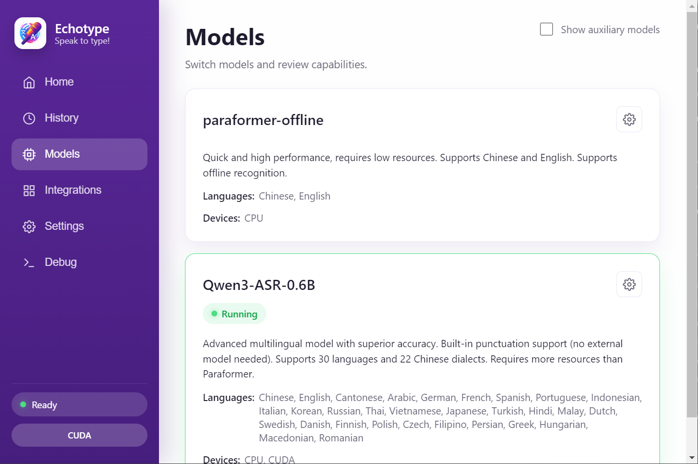
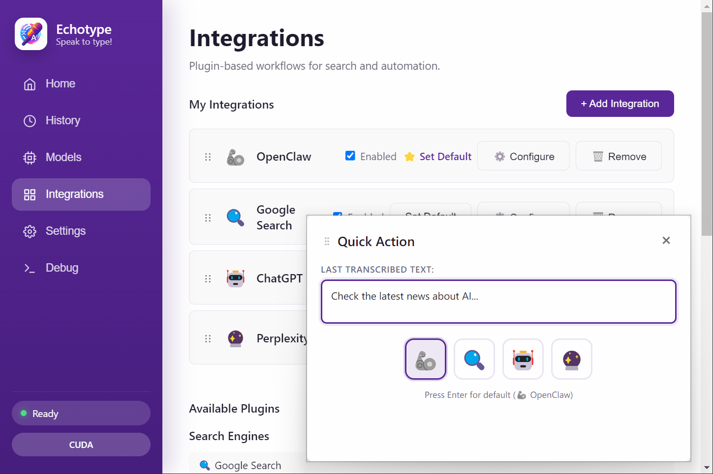

# EchoType All-in-One

<div align="center">


**🎤 Modern Voice-to-Text Application with AI Integration**

Fast · Offline · Intelligent · Cross-platform

[📥 Download](https://github.com/ljyou001/echotype/releases) · [📖 Documentation](#documentation) · [🛠 Development](#development)

[English](README.md) | [简体中文](README_ZH.md)

</div>

---

## 📖 Overview

EchoType All-in-One is a complete rewrite of the original EchoType project, featuring a modern Electron-based frontend and Python backend architecture. It provides real-time voice-to-text transcription with support for multiple AI models and integration with external AI services.

### Key Features

- **🎤 Real-time Voice Recognition**: Instant speech-to-text with multiple model support
- **🤖 AI Integration**: Direct integration with OpenClaw, ChatGPT, Claude, and more
- **⚡ Quick Actions**: Hotkey-triggered quick action window for instant AI interactions
- **🌍 Multilingual**: Support for English and Chinese with i18n framework
- **🔒 Privacy-First**: Completely offline processing with local AI models
- **🎨 Modern UI**: Clean, intuitive interface built with React and TypeScript

## 📸 Screenshots

| Main Interface | Models Management | Quick Actions |
|:---:|:---:|:---:|
|  |  |  |
| *Modern Dashboard* | *Model Switching* | *AI Integrations* |

## 🏗 Architecture

### Frontend (Electron + React)
- **Framework**: Electron with React and TypeScript
- **UI Library**: React with Zustand for state management
- **Styling**: Custom CSS with modern design system
- **Build Tool**: Vite for fast development and building

### Backend (Python)
- **Framework**: FastAPI with WebSocket support
- **Models**: Sherpa-ONNX (Paraformer) and Qwen3-ASR
- **Audio Processing**: Real-time audio streaming and processing
- **API**: RESTful API and WebSocket for real-time communication

## 🚀 Quick Start

### Prerequisites

- **Node.js**: v18 or higher
- **Python**: 3.9 or higher
- **Operating System**: Windows 10/11 or macOS 10.14+

### Installation

1. **Clone the repository**
   ```bash
   git clone https://github.com/ljyou001/echotype.git
   cd echotype/all-in-one
   ```

2. **Install backend dependencies**
   ```bash
   python -m venv .venv
   .venv\Scripts\activate  # Windows
   # source .venv/bin/activate  # macOS/Linux
   pip install -r requirements-backend.txt
   ```

3. **Install frontend dependencies**
   ```bash
   cd frontend
   npm install
   ```

4. **Download AI models**
   - Models are stored in `models/` directory
   - Paraformer (offline): ~200MB
   - Qwen3-ASR (offline): ~1.2GB

### Running in Development

**Option 1: Using launcher (Recommended)**
```bash
python launcher.py
```

**Option 2: Manual start**

Terminal 1 (Backend):
```bash
.venv\Scripts\activate
python -m backend
```

Terminal 2 (Frontend):
```bash
cd frontend
npm run dev
```

### Building for Production

```bash
cd frontend
npm run build
```

The built application will be in `frontend/dist-electron/`.

## 📚 Documentation

### User Guides
- [Quick Start Guide](QUICKSTART.md) - Get started in 5 minutes
- [Configuration Guide](design/SETTINGS_EXPLAINED.md) - Detailed settings explanation
- [Hotkey Configuration](design/HOTKEY_IMPLEMENTATION.md) - Customize your hotkeys
- [Model Switching](design/MODEL_SWITCHING_GUIDE.md) - Switch between AI models

### Integration Guides
- [OpenClaw Integration](design/OPENCLAW_INTEGRATION.md) - Connect with OpenClaw AI agent
- [Quick Actions](design/QUICK_ACTION_INTEGRATION_SYSTEM.md) - Use quick action system
- [Integrations System](design/QUICK_ACTION_INTEGRATION_IMPLEMENTATION.md) - Add custom integrations

### Technical Documentation
- [Backend Specification](design/BACKEND_SPEC.md) - Backend API and architecture
- [Frontend Specification](design/FRONTEND_ELECTRON_SPEC_V2.md) - Frontend architecture
- [Model Architecture](design/MODEL_SETTINGS_ARCHITECTURE.md) - AI model system
- [Logging System](design/LOGGING_SYSTEM.md) - Debug and logging
- [i18n Guide](design/I18N_GUIDE.md) - Internationalization

### Development Guides
- [Packaging Guide](design/PACKAGING.md) - Build distributable packages
- [Deployment Guide](design/DEPLOYMENT.md) - Deploy to production
- [Testing Procedures](design/TESTING_PROCEDURES.md) - Test the application
- [Troubleshooting](design/TROUBLESHOOTING.md) - Common issues and solutions

## 🎯 Features

### Voice Recognition
- **Multiple Models**: Sherpa-ONNX (Paraformer) and Qwen3-ASR support
- **Real-time Processing**: Instant transcription with low latency
- **High Accuracy**: Advanced AI models for accurate recognition
- **Offline Support**: Works completely offline with local models

### Quick Actions
- **Hotkey Activation**: Trigger with customizable hotkey (default: Ctrl+Shift+Space)
- **AI Integrations**: Send transcribed text to ChatGPT, Claude, OpenClaw, etc.
- **Reply Display**: View AI responses directly in quick action window
- **Smart Positioning**: Window appears near cursor with intelligent placement

### Integrations
- **OpenClaw**: AI agent with WebSocket and HTTP API support
- **ChatGPT**: Direct integration with OpenAI's ChatGPT
- **Claude**: Anthropic's Claude AI assistant
- **Perplexity**: AI-powered search engine
- **Custom Integrations**: Easy to add new integrations

### User Interface
- **Modern Design**: Clean, intuitive interface with smooth animations
- **Dark Mode Ready**: Prepared for dark mode support
- **Responsive**: Adapts to different screen sizes
- **Accessible**: Keyboard navigation and screen reader support

### System Integration
- **System Tray**: Runs in background with tray icon
- **Auto-start**: Optional startup on system boot
- **Global Hotkeys**: System-wide hotkey support
- **Notifications**: Desktop notifications for important events

## 🛠 Development

### Project Structure

```
all-in-one/
├── backend/                 # Python backend
│   ├── common/             # Shared utilities
│   ├── qwen3/              # Qwen3 model adapter
│   ├── sherpa_adapter/     # Sherpa-ONNX adapter
│   ├── app.py              # FastAPI application
│   ├── manager.py          # Model manager
│   └── server.py           # WebSocket server
├── frontend/               # Electron frontend
│   ├── electron/           # Electron main process
│   ├── src/                # React application
│   │   ├── components/     # React components
│   │   ├── services/       # Business logic
│   │   ├── store/          # State management
│   │   └── i18n/           # Internationalization
│   ├── assets/             # Static assets
│   └── dist/               # Build output
├── models/                 # AI models
│   ├── paraformer-offline/ # Paraformer model
│   └── Qwen3-ASR-0.6B/     # Qwen3 model
├── design/                 # Documentation
├── test/                   # Test files
└── scripts/                # Utility scripts
```

### Technology Stack

**Frontend**:
- Electron 28+
- React 18
- TypeScript 5
- Vite 5
- Zustand (state management)
- i18next (internationalization)

**Backend**:
- Python 3.9+
- FastAPI
- WebSocket
- Sherpa-ONNX
- FunASR
- NumPy

### Development Workflow

1. **Make changes** in `frontend/src/` or `backend/`
2. **Test locally** using `npm run dev` or `python -m backend`
3. **Build** using `npm run build`
4. **Test build** by running the built application
5. **Commit** with clear commit messages

### Code Style

- **Frontend**: ESLint + Prettier
- **Backend**: Black + isort
- **Commits**: Conventional Commits format

## 🧪 Testing

### Frontend Testing
```bash
cd frontend
npm run dev  # Development mode with hot reload
```

### Backend Testing
```bash
.venv\Scripts\activate
python -m backend --host 127.0.0.1 --port 6016
```

### Integration Testing
```bash
# Test OpenClaw integration
open test/test_openclaw_api.html

# Test WebSocket connection
open test/test_ws_simple.html
```

## 📦 Building & Packaging

### Build Frontend
```bash
cd frontend
npm run build
```

### Package Application
```bash
cd frontend
npm run build:win  # Windows
npm run build:mac  # macOS
```

See [Packaging Guide](design/PACKAGING.md) for detailed instructions.

## 🐛 Troubleshooting

### Common Issues

**Backend won't start**
- Check Python version (3.9+)
- Verify virtual environment is activated
- Install dependencies: `pip install -r requirements-backend.txt`

**Frontend won't build**
- Check Node.js version (18+)
- Clear node_modules: `rm -rf node_modules && npm install`
- Clear cache: `npm run clean`

**Models not loading**
- Verify models are in `models/` directory
- Check model paths in `backend/models_catalog.json`
- Ensure sufficient disk space

**Hotkeys not working**
- Check hotkey configuration in settings
- Verify no conflicts with other applications
- Try different hotkey combinations

See [Troubleshooting Guide](design/TROUBLESHOOTING.md) for more solutions.

## 🤝 Contributing

Contributions are welcome! Please read our contributing guidelines before submitting PRs.

1. Fork the repository
2. Create a feature branch
3. Make your changes
4. Test thoroughly
5. **Sign the [Contributor License Agreement (CLA)](CLA.md)** if you are a first-time contributor (see [CONTRIBUTING.md](CONTRIBUTING.md))
6. Submit a pull request

## 📄 License

This project is licensed under the **GNU Affero General Public License v3.0 or later (AGPL-3.0-or-later)**. See the [LICENSE](LICENSE) file for details. Contributions are governed by the [Contributor License Agreement (CLA)](CLA.md).

## 🙏 Acknowledgments

- Original [CapsWriter-Offline](https://github.com/HaujetZhao/CapsWriter-Offline) project
- [Sherpa-ONNX](https://github.com/k2-fsa/sherpa-onnx) for offline speech recognition
- [FunASR](https://github.com/alibaba-damo-academy/FunASR) for Paraformer model
- [Qwen](https://github.com/QwenLM/Qwen) for Qwen3-ASR model
- [OpenClaw](https://github.com/openclaw/openclaw) for AI agent integration

## 📞 Support

- **Issues**: [GitHub Issues](https://github.com/ljyou001/echotype/issues)
- **Discussions**: [GitHub Discussions](https://github.com/ljyou001/echotype/discussions)
- **Documentation**: [Design Docs](design/)

---

<div align="center">

**⭐ If this project helps you, please give it a Star!**

Made with ❤️ by ljyou001

</div>
